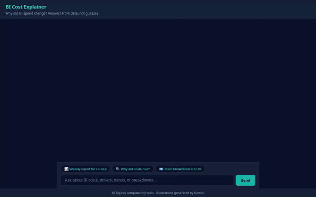
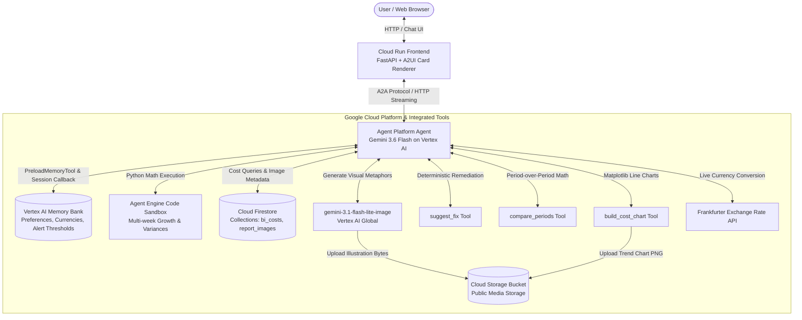

# BI Cost Explainer

> Why did BI spend change? Answers from data, not guesses.

An intelligent, data-grounded assistant for BI platform and FinOps teams. It analyzes period-over-period spend across teams (Sales, Marketing, Supply Chain, Finance) and tools (Looker, Looker Studio, Tableau), isolates root causes using data-scan and query metrics, provides deterministic remediation advice, and renders interactive reports using A2UI.

---

## 🎬 Demo



*Screen recording captured directly from the live chat UI with Google's Lyria-generated background music and A2UI card rendering.*

---

## 📊 The Story in the Data

The agent operates over an 8-week dataset of weekly BI cost records across 4 teams and 3 BI tools. 

> [!NOTE]
> **All figures and records in this dataset are entirely synthetic.**

### The Planted Anomaly
In the week starting **2026-09-14**, the Sales team's Looker Studio spend abruptly triples:
- **Symptom**: Cost increases by +194% (from ~$1,850 to ~$5,450).
- **Root Cause**: The dashboard `"Daily Store Sales Live"` was modified to run unpartitioned full table scans. Data scanned (`gb_processed`) spikes dramatically by +227% (from 3,420 GB to 11,190 GB), while query volume remains completely flat (~4,210 queries).
- **Remediation**: Add date partition filters or switch the dashboard from direct live queries to an extract/scheduled refresh.

### The Red Herring
During the same week, the Marketing team experiences a **+40% spike in query volume**:
- Query count surges from 5,100 to 7,140 queries.
- **Why it's a red herring**: Spend barely increases (<$30 change) because Marketing's queries hit small lookup tables and cached result sets.
- **Status**: Efficient usage growth requiring no engineering intervention.

---

## 🎯 Design Principle

> **Every number comes from a tool lookup or sandbox computation; generated images never contain numbers.**

- **Strict Grounding**: The LLM is never allowed to invent, extrapolate, or guess metrics. Every metric, delta, percentage, and currency value presented in cards and tables is retrieved directly from Cloud Firestore, calculated deterministically via `compare_periods`, or computed in the Python code execution sandbox.
- **Illustrations as Metaphors**: Generated illustrations (powered by Gemini Image on Vertex AI) represent conceptual metaphors (such as a giant vacuum hoovering up warehouse boxes for full table scans, or a smooth conveyor belt for efficient usage growth) or visual cover art. They deliberately omit text, numbers, and charts to eliminate any risk of hallucinated data points.
- **Charts via Code**: Visual trend charts are rendered programmatically using Matplotlib inside `build_cost_chart` and saved as PNG artifacts to Cloud Storage.

---

## 🏛️ Architecture



---

## 🛠️ Tools Reference

The agent utilizes the following function tools defined in `app/tools/`:

| Tool Name | Source File | Description |
|---|---|---|
| `get_costs` | `app/tools/bi_cost_tools.py` | Queries filtered BI cost records from Firestore (`bi_costs` collection) by team, tool, or week range. |
| `compare_periods` | `app/tools/bi_cost_tools.py` | Compares spend, data scanned (GB), and query counts between two weeks; computes deltas and percentage changes. |
| `suggest_fix` | `app/tools/bi_cost_tools.py` | Evaluates query count vs data scanned deltas and returns deterministic remediation guidance. |
| `list_available_weeks` | `app/tools/bi_cost_tools.py` | Returns all available chronological `week_start` dates present in Firestore. |
| `convert_currency` | `app/tools/bi_cost_tools.py` | Converts currency figures using live rates from the public Frankfurter exchange-rate API. |
| `generate_cover_image` | `app/tools/image_tools.py` | Generates a dark-navy/teal/amber cover illustration with `gemini-3.1-flash-lite-image`, uploads it to Cloud Storage, and caches the URL in Firestore. |
| `generate_driver_image` | `app/tools/image_tools.py` | Generates a visual metaphor illustration representing the cost driver fix type, uploads it to Cloud Storage, and caches it in Firestore. |
| `build_cost_chart` | `app/tools/chart_tools.py` | Programmatically plots multi-week tool cost trends using Matplotlib and uploads the image to Cloud Storage. |
| `PreloadMemoryTool` | `google.adk.tools` | Preloads user team, currency preference (e.g. EUR), and alert thresholds (>20%) from Vertex AI Memory Bank. |
| `AgentEngineSandboxCodeExecutor` | `google.adk.code_executors` | Executes Python code in a secure Vertex AI Agent Engine sandbox for verifiable statistical calculations. |

*Planned, not yet implemented:*
- *Cloud Trace custom span instrumentation for individual tool latency breakdowns.*

---

## 🚀 Setup and Run Instructions

### 1. Hardcoded Values to Replace
To run this project in your own Google Cloud project, update the following configuration variables:

- **Google Cloud Project ID**: Replace `qwiklabs-gcp-03-6baaeaff7c42` with your project ID in:
  - `app/tools/bi_cost_tools.py` (`PROJECT_ID`)
  - `app/tools/image_tools.py` (`PROJECT_ID`)
  - `app/tools/chart_tools.py` (`PROJECT_ID`)
  - `seed_firestore.py` (`PROJECT_ID`)
- **Cloud Storage Bucket**: Replace `bi-cost-explainer-o7rv0e` with your public storage bucket name in:
  - `app/tools/image_tools.py` (`BUCKET_NAME`)
  - `app/tools/chart_tools.py` (`BUCKET_NAME`)
- **Agent Engine & Sandbox Resource Names**: In `app/agent.py`:
  - `SANDBOX_RESOURCE_NAME`: Update to your Vertex AI sandbox environment resource URI.
  - Hardcoded engine ID in deployment scripts.

### 2. Environment Setup
```bash
# Clone and enter directory
cd bi-cost-explainer

# Create virtual environment and install dependencies
python3 -m venv .venv
source .venv/bin/activate
pip install -r requirements.txt
```

### 3. Seed Firestore Data
```bash
python seed_firestore.py
```

### 4. Run the Agent Locally (ADK Web)
```bash
adk web app
```

### 5. Run the Custom Frontend Locally
```bash
cd frontend
python3 -m venv .venv
source .venv/bin/activate
pip install -r requirements.txt

export AGENT_ENGINE_RESOURCE_NAME="projects/<PROJECT_NUMBER>/locations/<REGION>/reasoningEngines/<ENGINE_ID>"
export AGENT_DIRECTORY="app"
python main.py
```

### 6. Deploy to Google Cloud

**Deploy Agent to Agent Platform (Agent Runtime):**
```bash
agents-cli deploy agent_runtime \
  --agent-directory app \
  --service-name simple-agent \
  --memory-service "https://<REGION>-aiplatform.googleapis.com/v1beta1/projects/<PROJECT_NUMBER>/locations/<REGION>/reasoningEngines/<ENGINE_ID>:execute"
```

**Deploy Frontend to Cloud Run:**
```bash
cd frontend
gcloud run deploy bi-cost-frontend \
  --source . \
  --region us-east1 \
  --allow-unauthenticated \
  --set-env-vars AGENT_ENGINE_RESOURCE_NAME="projects/<PROJECT_NUMBER>/locations/<REGION>/reasoningEngines/<ENGINE_ID>",AGENT_DIRECTORY="app"
```

---

## 🏆 Attribution

Built at **Build with Gemini Munich 2026, Track 3** ([Build with Gemini Starter Kit](https://github.com/cszhu/build-with-gemini)).
