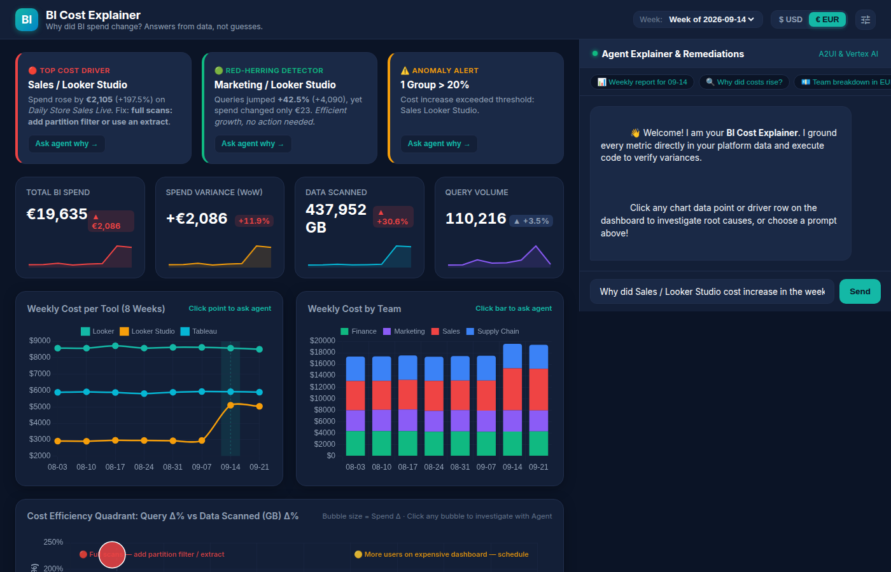
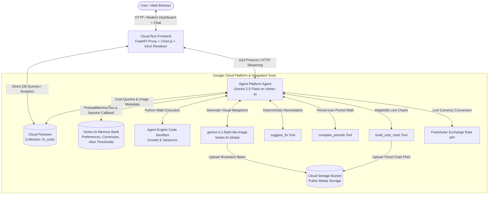

# BI Cost Explainer

> Why did BI spend change? Answers from data, not guesses.

An intelligent, data-grounded assistant and modern BI spend dashboard for BI platform and FinOps teams. It combines an interactive analytics dashboard with an autonomous agent to analyze period-over-period spend across teams (Sales, Marketing, Supply Chain, Finance) and tools (Looker, Looker Studio, Tableau), isolate root causes using data-scan and query metrics, provide deterministic remediation advice, and render interactive reports using A2UI.

---

## 🎬 Dashboard & Live Demo

### Interactive BI Cost Dashboard


*The modern interactive dashboard: automated insight cards, period-over-period KPI sparklines, weekly tool trends, team cost distributions, and the signature Cost Efficiency Quadrant.*

### Agent Explainer in Action


*Screen recording captured directly from the live chat UI with Google's Lyria-generated background music and A2UI card rendering.*

---

## 📊 The Story in the Data

The system operates over an 8-week dataset of weekly BI cost records across 4 teams and 3 BI tools stored directly in Google Cloud Firestore.

> [!NOTE]
> **All figures and records in this dataset are entirely synthetic.**

### The Planted Anomaly
In the week starting **2026-09-14**, the Sales team's Looker Studio spend abruptly surges:
- **Symptom**: Cost increases by +197.5% (from ~$1,210 to ~$3,600).
- **Root Cause**: The dashboard `"Daily Store Sales Live"` was modified to run unpartitioned full table scans. Data scanned (`gb_processed`) spikes dramatically by +227.3% (from 45,378 GB to 148,500 GB), while query volume remains completely flat (~14,925 queries, -0.5%).
- **Remediation**: Add date partition filters or switch the dashboard from direct live queries to an extract/scheduled refresh.

### The Red Herring
During the same week, the Marketing team experiences a **+42.5% spike in query volume**:
- Query count surges from 9,630 to 13,720 queries (+4,090 queries).
- **Why it's a red herring**: Spend barely increases (+$26.52) because Marketing's queries hit small lookup tables and cached result sets.
- **Status**: Efficient usage growth requiring no engineering intervention.

---

## 🎯 Design Principle

> **Every number comes from code, database queries, or sandbox computation; generated images never contain numbers.**

- **Strict Grounding**: The LLM is never allowed to invent, extrapolate, or guess metrics. Every metric, delta, percentage, and currency value presented in the dashboard and chat is retrieved directly from Cloud Firestore, calculated deterministically via code, or computed in the Python code execution sandbox.
- **Visual Analytics Separation**: The dashboard shows **WHAT** changed (via deterministic SQL/Firestore aggregations and Chart.js); the agent explains **WHY** (root causes, queries, generated visual analogies, and remediations).
- **Illustrations as Metaphors**: Generated illustrations (powered by Gemini Image on Vertex AI) represent conceptual metaphors (such as a giant vacuum hoovering up warehouse boxes for full table scans, or a smooth conveyor belt for efficient usage growth). They deliberately omit text and numbers to eliminate any risk of hallucinated data points.
- **Charts via Code**: Visual trend charts in the chat are rendered programmatically using Matplotlib inside `build_cost_chart` and saved as PNG artifacts to Cloud Storage.

---

## ✨ Features

### 1. Interactive BI Spend Dashboard
- **Insights on Start**: Three automated insight cards computed on page load:
  - 🔴 **Top Cost Driver**: Highlights the single largest dollar variance (Sales / Looker Studio), dashboard name, and fix recommendation.
  - 🟢 **Red-Herring Detector**: Identifies groups with high query growth but flat costs (Marketing / Looker Studio), avoiding wasted engineering time.
  - ⚠️ **Anomaly Threshold Alerts**: Dynamically counts and displays groups exceeding a customizable cost spike threshold (default 20%).
- **Period-over-Period KPIs**: Total spend, WoW variance, data scanned (GB), and query counts with colored variance indicators and sparklines across all 8 weeks.
- **Multi-Week Trend Charts**:
  - **Tool Trend Line Chart**: Historical weekly cost across Looker, Looker Studio, and Tableau, with a translucent vertical band highlighting the selected week.
  - **Team Stacked Bar Chart**: Weekly cost breakdown by team.
- **Cost Efficiency Quadrant (Signature Scatter Plot)**:
  - **X-axis**: Query Count Change ($\Delta\%$)
  - **Y-axis**: Data Scanned Change ($\Delta\%$)
  - **Bubble Size**: Spend Variance ($\Delta\$$)
  - **4 Labeled Quadrants**:
    1. *Top-Left (Full scans)*: High GB, flat queries $\to$ partition filter / extract (Sales lands here).
    2. *Top-Right (High usage)*: High GB, high queries $\to$ schedule instead of live.
    3. *Bottom-Right (Efficient growth)*: Flat GB, high queries $\to$ no action (Marketing lands here).
    4. *Bottom-Left (Declining)*: Declining or normal variance.
- **Top Drivers Table**: Sortable table with deterministic remediation badges.
- **Interactive Chat Pre-fill**: Clicking any chart data point, stacked bar, quadrant bubble, or table row automatically populates the agent chat input with a targeted investigation question.
- **Real-Time Currency Switching**: Toggle between USD ($) and EUR (€) with live rates fetched from the Frankfurter exchange rate API.

### 2. Autonomous Agent & Explainer
- **Multi-Turn Chat with A2UI**: Seamless A2UI card renderer displaying cards, columns, rows, images, and tables.
- **Cross-Session Memory**: Integrates Vertex AI Memory Bank to retain user preferences, default currency, and alert thresholds across sessions.
- **Code Execution Sandbox**: Evaluates complex growth rates and statistical calculations securely in a Vertex AI Agent Engine sandbox.
- **Gemini Image Generation**: Generates conceptual cover and remediation analogy artwork via `gemini-3.1-flash-lite-image`.

---

## 🏛️ Architecture



---

## 🛠️ Tools Reference

The agent utilizes the following function tools defined in `app/tools/`:

| Tool Name | Source File | Description |
|---|---|---|
| `get_costs` | `app/tools/bi_cost_tools.py` | Queries filtered BI cost records from Firestore (`bi_costs` collection) by team, tool, or week range. |
| `compare_periods` | `app/tools/bi_cost_tools.py` | Compares spend, data scanned (GB), and query counts between two weeks; computes deltas and percentage changes. |
| `suggest_fix` | `app/tools/bi_cost_tools.py` | Evaluates query count vs data scanned deltas and returns deterministic remediation guidance. |
| `list_available_weeks` | `app/tools/bi_cost_tools.py` | Returns all available chronological `week_start` dates present in Firestore. |
| `convert_currency` | `app/tools/bi_cost_tools.py` | Converts currency figures using live rates from the public Frankfurter exchange-rate API. |
| `generate_cover_image` | `app/tools/image_tools.py` | Generates a dark-navy/teal/amber cover illustration with `gemini-3.1-flash-lite-image`, uploads it to Cloud Storage, and caches the URL in Firestore. |
| `generate_driver_image` | `app/tools/image_tools.py` | Generates a visual metaphor illustration representing the cost driver fix type, uploads it to Cloud Storage, and caches it in Firestore. |
| `build_cost_chart` | `app/tools/chart_tools.py` | Programmatically plots multi-week tool cost trends using Matplotlib and uploads the image to Cloud Storage. |
| `PreloadMemoryTool` | `google.adk.tools` | Preloads user team, currency preference (e.g. EUR), and alert thresholds (>20%) from Vertex AI Memory Bank. |
| `AgentEngineSandboxCodeExecutor` | `google.adk.code_executors` | Executes Python code in a secure Vertex AI Agent Engine sandbox for verifiable statistical calculations. |

*Planned, not yet implemented:*
- *Cloud Trace custom span instrumentation for individual tool latency breakdowns.*

---

## 🚀 Setup and Run Instructions

### 1. Hardcoded Values to Replace
To run this project in your own Google Cloud project, update the following configuration variables:

- **Google Cloud Project ID**: Replace `qwiklabs-gcp-03-6baaeaff7c42` with your project ID in:
  - `frontend/main.py` (`PROJECT_ID`)
  - `app/tools/bi_cost_tools.py` (`PROJECT_ID`)
  - `app/tools/image_tools.py` (`PROJECT_ID`)
  - `app/tools/chart_tools.py` (`PROJECT_ID`)
  - `seed_firestore.py` (`PROJECT_ID`)
- **Cloud Storage Bucket**: Replace `bi-cost-explainer-o7rv0e` with your public storage bucket name in:
  - `app/tools/image_tools.py` (`BUCKET_NAME`)
  - `app/tools/chart_tools.py` (`BUCKET_NAME`)
- **Agent Engine & Sandbox Resource Names**: In `app/agent.py`:
  - `SANDBOX_RESOURCE_NAME`: Update to your Vertex AI sandbox environment resource URI.

### 2. Environment Setup
```bash
# Clone and enter directory
cd bi-cost-explainer

# Create virtual environment and install dependencies
python3 -m venv .venv
source .venv/bin/activate
pip install -r requirements.txt
```

### 3. Seed Firestore Data
```bash
python seed_firestore.py
```

### 4. Run the Agent Locally (ADK Web)
```bash
adk web app
```

### 5. Run the Custom Frontend Locally
```bash
cd frontend
python3 -m venv .venv
source .venv/bin/activate
pip install -r requirements.txt

export AGENT_ENGINE_RESOURCE_NAME="projects/<PROJECT_NUMBER>/locations/<REGION>/reasoningEngines/<ENGINE_ID>"
export AGENT_DIRECTORY="app"
python main.py
# Open http://localhost:8080
```

### 6. Deploy to Google Cloud

**Deploy Agent to Agent Platform (Agent Runtime):**
```bash
agents-cli deploy agent_runtime \
  --agent-directory app \
  --service-name simple-agent \
  --memory-service "https://<REGION>-aiplatform.googleapis.com/v1beta1/projects/<PROJECT_NUMBER>/locations/<REGION>/reasoningEngines/<ENGINE_ID>:execute"
```

**Deploy Frontend to Cloud Run:**
```bash
# Ensure Cloud Run service account has permissions to invoke Agent Engine and read Firestore
gcloud projects add-iam-policy-binding <PROJECT_ID> \
  --member="serviceAccount:<SERVICE_ACCOUNT_EMAIL>" \
  --role="roles/aiplatform.user"

gcloud projects add-iam-policy-binding <PROJECT_ID> \
  --member="serviceAccount:<SERVICE_ACCOUNT_EMAIL>" \
  --role="roles/datastore.user"

cd frontend
gcloud run deploy bi-cost-frontend \
  --source . \
  --region us-east1 \
  --allow-unauthenticated \
  --service-account <SERVICE_ACCOUNT_EMAIL> \
  --set-env-vars AGENT_ENGINE_RESOURCE_NAME="projects/<PROJECT_NUMBER>/locations/<REGION>/reasoningEngines/<ENGINE_ID>,AGENT_DIRECTORY=app"
```

---

## 🏆 Attribution

Built at **Build with Gemini Munich 2026, Track 3** ([Build with Gemini Starter Kit](https://github.com/cszhu/build-with-gemini)).
